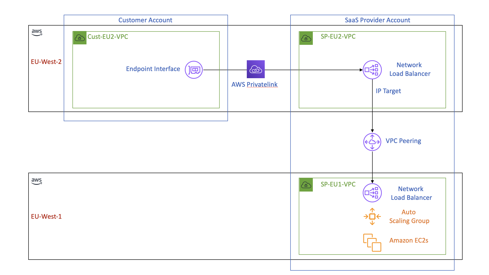

**<h1>Creating an AWS Cross-Region VPC PrivateLink using VPC Peering with Terraform</h1>**

**<h2>Description</h2>**
This blog post provides a step-by-step guide on setting up an AWS cross-region VPC PrivateLink using VPC peering for SaaS providers who host their platform in one AWS region and serving customers in other regions. The setup ensures secure and efficient access to the SaaS platform via AWS PrivateLink, avoiding traffic traversing the public internet and limited to network traffic allowed by the Network Loadbalancer. The post covers creating separate AWS profiles for the provider and customer, setting up Terraform configurations and variables, deploying a static website using an autoscaling group for the provider, establishing VPC peering between the provider's regions, and setting up PrivateLink between the provider and customer.

**<h3>Introduction</h3>**



SaaS providers often need to cater to customers across various geographical locations. To provide a secure and efficient way for customers to access their platform, SaaS providers can utilize AWS PrivateLink. By creating a cross-region VPC PrivateLink using VPC peering, SaaS providers can securely serve customers in different AWS regions, even if their platform is deployed in just one region.

This blog post will guide you through the process of creating a cross-region VPC PrivateLink for a SaaS provider who hosts their platform in the EU-WEST-1 region and serves customers in the EU-WEST-2 region. We will use Terraform to automate the creation of resources and cover the following steps:

1. Create separate AWS profiles for the SaaS provider and customer
2. Set up Terraform configurations and variables
3. Deploy the SaaS provider's infrastructure in the EU-WEST-1 region
4. Establish VPC peering between the SaaS provider's EU-WEST-1 and EU-WEST-2 regions
5. Set up endpoint service for the SaaS provider in the EU-WEST-2 region
6. Set up PrivateLink between the customer's EU-WEST-2 VPC and the SaaS provider's EU-WEST-2 VPC
7. Verify the connectivity

**<h3>Prerequisites</h3>**
* Two AWS accounts (one for the SaaS provider and one for the customer) with the necessary permissions to create resources
* Terraform installed on your local machine or AWS Cloud9
* Basic understanding of AWS VPC, PrivateLink, and Terraform

**<h3>Step 1: Create separate AWS profiles unts for the SaaS provider and customer</h3>**
In this step, we will create separate AWS profiles for the SaaS provider and customer in the AWS CLI configuration file. This helps us manage and use different AWS credentials for each account without mixing them up. Open your AWS CLI configuration file (usually located in ~/.aws/credentials) and add the following lines with the appropriate AWS access key IDs and secret access keys for the SaaS provider and customer:

```
[saas_provider]
aws_access_key_id = <SAAS_PROVIDER_AWS_ACCESS_KEY_ID>
aws_secret_access_key = <SAAS_PROVIDER_AWS_SECRET_ACCESS_KEY>

[customer]
aws_access_key_id = <CUSTOMER_AWS_ACCESS_KEY_ID>
aws_secret_access_key = <CUSTOMER_AWS_SECRET_ACCESS_KEY>

```

After setting up the AWS profiles, create a providers.tf file that defines the AWS providers for both the SaaS provider and the customer using their respective profiles. We'll create three providers in total, two for the SaaS provider (one for each region, EU-WEST-1 and EU-WEST-2) and one for the customer (in the EU-WEST-2 region). The alias attribute helps differentiate the providers while using them in other Terraform configurations.

```
provider "aws" {
  alias   = "sp_eu1"
  region  = "eu-west-1"
  profile = "saas_provider"
}

provider "aws" {
  alias   = "sp_eu2"
  region  = "eu-west-2"
  profile = "saas_provider"
}

provider "aws" {
  alias   = "cust_eu2"
  region  = "eu-west-2"
  profile = "customer"
}

```

In the next step, we will set up Terraform configurations and variables to continue building our infrastructure.

**<h3>Step 2: Set up Terraform configurations and variables</h3>**

In this step, we will define the necessary Terraform variables that will be used throughout the infrastructure setup. Create a variables.tf file and add the following variables with their descriptions and default values:

1. sp_eu1_ami_ssm_parameter_name: The AWS Systems Manager (SSM) parameter name for the SaaS provider's EC2 AMI in the EU-WEST-1 region.
2. sp_instance_type: The EC2 instance type for the SaaS provider's static website.
3. sp_key_pair_name: The name of the key pair for the SaaS provider's EC2 instances.
4. sp_eu1_vpc_cidr: The CIDR block for the SaaS provider's VPC in the EU-WEST-1 region.
5. sp_eu1_subnet_cidrs: A map of the CIDR blocks for the SaaS provider's subnets in the EU-WEST-1 region.
6. aws_profile: The AWS CLI profile to use for both the SaaS provider and customer accounts.
7. sp_account_id: The AWS account ID of the SaaS provider.
8. customer_account_id: The AWS account ID of the customer.
9. cust_eu2_vpc_cidr: The CIDR block for the customer's VPC in the EU-WEST-2 region.

```
variable "sp_eu1_ami_ssm_parameter_name" {
  description = "The SSM parameter name for the SaaS provider's EC2 AMI in the EU-WEST-1 region"
  default     = "/aws/service/ami-amazon-linux-latest/amzn2-ami-hvm-x86_64-gp2"
}

variable "sp_instance_type" {
  description = "EC2 instance type for the SaaS provider's static website"
  default     = "t2.micro"
}

variable "sp_key_pair_name" {
  description = "The name of the key pair for the SaaS provider's EC2 instances"
  default     = "sp_ec2_key_name"
}

variable "sp_eu1_vpc_cidr" {
  description = "The CIDR block for the SaaS provider's VPC in EU-WEST-1 region"
  default     = "10.0.0.0/16"
}

variable "sp_eu1_subnet_cidrs" {
  description = "The CIDR blocks for the SaaS provider's subnets in EU-WEST-1 region"
  default = {
    "subnet_a" = "10.0.1.0/24"
    "subnet_b" = "10.0.2.0/24"
    "subnet_c" = "10.0.3.0/24"
  }
}

variable "aws_profile" {
  description = "AWS CLI profile to use for the SaaS provider and customer accounts"
  default     = "default"
}

variable "sp_account_id" {
  type        = string
  description = "SaaS provider's AWS account ID"
}

variable "customer_account_id" {
  description = "The AWS account ID of the customer"
  type        = string
}

variable "cust_eu2_vpc_cidr" {
  description = "The CIDR block for the customer's VPC in the EU-WEST-2 region"
  default     = "10.1.0.0/16"
}

```

By defining these variables, we can easily customize the infrastructure configuration and make changes without modifying the actual Terraform code. In the next step, we will deploy the SaaS provider's infrastructure in the EU-WEST-1 region using these variables to customize the resource creation process.

In subsequent steps, we will use these variables to set up the VPC, subnets, and other resources for both the SaaS provider and the customer. This approach allows for a more flexible and maintainable infrastructure code, as you can easily modify the variables' values to fit your specific requirements without changing the underlying Terraform code.

**<h3>Step 3: Deploy the SaaS provider's infrastructure in the EU-WEST-1 region</h3>**
In step 3, the Terraform code sp_eu1_infra.tf is used to create the SaaS provider's infrastructure in the EU-WEST-1 region. The code is structured into different sections, which are explained below:

- TLS private key and key pair creation, and storing in AWS Secrets Manager: This section creates a TLS private key, an AWS key pair, and stores the private key in AWS Secrets Manager for secure storage.

- VPC and subnet creation: This section creates a VPC and three subnets within the VPC for the SaaS provider in the EU-WEST-1 region.

- Security group and rules: This section sets up security groups and rules for the SaaS provider's infrastructure, allowing ingress on port 80 (HTTP) and egress on port 443 (HTTPS).

- Custom AMI creation: This part of the code creates a custom AMI based on an existing Amazon Linux 2 AMI, with the httpd service enabled, and the newly generated key-pair for SSH access.

- Launch configuration and autoscaling group: This section creates a launch configuration and an autoscaling group for the SaaS provider's infrastructure, specifying the instance type, key pair, and security group.

- Network load balancer and related resources: This part of the code sets up a Network Load Balancer, target group, and listener for the SaaS provider's infrastructure, enabling the load balancer to distribute traffic across instances.

- VPC endpoints: This section creates VPC endpoints for AWS Systems Manager (SSM), EC2 messages, and SSM messages services, ensuring that communication between the VPC and these services remains private and does not traverse the public internet.

By executing this Terraform code, the SaaS provider's infrastructure will be created and configured in the EU-WEST-1 region.

```
# TLS private key and key pair creation, and storing in AWS Secrets Manager
resource "tls_private_key" "sp_eu1_key" {
  algorithm = "RSA"
}

resource "aws_key_pair" "sp_eu1_key" {
  provider = aws.sp_eu1

  key_name   = var.sp_key_pair_name
  public_key = tls_private_key.sp_eu1_key.public_key_openssh
}

resource "aws_secretsmanager_secret" "sp_eu1_key_secret" {
  provider = aws.sp_eu1

  name = "${var.sp_key_pair_name}_private_key25"
}

resource "aws_secretsmanager_secret_version" "sp_eu1_key_secret_version" {
  provider = aws.sp_eu1

  secret_id     = aws_secretsmanager_secret.sp_eu1_key_secret.id
  secret_string = tls_private_key.sp_eu1_key.private_key_pem
}

# VPC and subnet creation
resource "aws_vpc" "sp_eu1_vpc" {
  provider = aws.sp_eu1

  cidr_block = var.sp_eu1_vpc_cidr
  enable_dns_hostnames = true
  enable_dns_support   = true

  tags = {
    Name = "sp-eu1-vpc"
  }
}

resource "aws_subnet" "sp_eu1_subnet" {
  count    = 3
  provider = aws.sp_eu1

  cidr_block        = "10.0.${count.index + 1}.0/24"
  vpc_id            = aws_vpc.sp_eu1_vpc.id
  availability_zone = "eu-west-1${count.index == 0 ? "a" : count.index == 1 ? "b" : "c"}"

  tags = {
    Name = "sp-eu1-subnet-${count.index + 1}"
  }
}

# Security group and rules
resource "aws_security_group" "sp_eu1_sg" {
  provider = aws.sp_eu1

  name        = "sp-eu1-sg"
  description = "Security group for the SaaS provider static website in EU-WEST-1"
  vpc_id      = aws_vpc.sp_eu1_vpc.id
}

resource "aws_security_group_rule" "sp_eu1_sg_allow_http" {
  provider = aws.sp_eu1

  security_group_id = aws_security_group.sp_eu1_sg.id

  type        = "ingress"
  from_port   = 80
  to_port     = 80
  protocol    = "tcp"
  cidr_blocks = ["0.0.0.0/0"]
}

resource "aws_security_group_rule" "sp_eu1_sg_allow_https_egress" {
  provider = aws.sp_eu1

  security_group_id = aws_security_group.sp_eu1_sg.id

  type        = "egress"
  from_port   = 443
  to_port     = 443
  protocol    = "tcp"
  cidr_blocks = ["0.0.0.0/0"]
}

data "aws_ssm_parameter" "sp_eu1_ami_id" {
  name = var.sp_eu1_ami_ssm_parameter_name
}

# Create custom AMI with httpd service enabled and the newly generated key-pair for SSH

data "aws_vpc" "default" {
  provider = aws.sp_eu1
  default  = true
}

data "aws_subnets" "default" {
  provider = aws.sp_eu1
  filter {
    name   = "vpc-id"
    values = [data.aws_vpc.default.id]
  }
}

resource "aws_security_group" "sp_eu1_ami_sg" {
  provider = aws.sp_eu1

  name        = "sp-eu1-ami_sg"
  description = "Security group for the AMI in EU-WEST-1"
  vpc_id      = data.aws_vpc.default.id
}

resource "aws_security_group_rule" "sp_eu1_ami_sg_allow_http" {
  provider = aws.sp_eu1

  security_group_id = aws_security_group.sp_eu1_ami_sg.id

  type        = "ingress"
  from_port   = 80
  to_port     = 80
  protocol    = "tcp"
  cidr_blocks = ["0.0.0.0/0"]
}

resource "aws_security_group_rule" "sp_eu1_ami_sg_allow_https_egress" {
  provider = aws.sp_eu1

  security_group_id = aws_security_group.sp_eu1_ami_sg.id

  type        = "egress"
  from_port   = 443
  to_port     = 443
  protocol    = "tcp"
  cidr_blocks = ["0.0.0.0/0"]
}

resource "aws_instance" "sp_eu1_web" {
  provider = aws.sp_eu1

  ami           = data.aws_ssm_parameter.sp_eu1_ami_id.value
  instance_type = var.sp_instance_type
  key_name      = aws_key_pair.sp_eu1_key.key_name

  vpc_security_group_ids = [aws_security_group.sp_eu1_ami_sg.id]
  subnet_id              = tolist(data.aws_subnets.default.ids)[0]

  user_data = <<-EOF
                #!/bin/bash
                yum update -y
                yum install -y httpd
                systemctl start httpd
                systemctl enable httpd
                chkconfig httpd on
                echo "<h1>Hello World</h1><p>AWS Cross region privatelink using vpc peering, successful</p>" > /var/www/html/index.html
              EOF

  tags = {
    Name = "sp-eu1-web"
  }

  depends_on = [aws_security_group.sp_eu1_ami_sg]

  lifecycle {
    ignore_changes = [ami, key_name, user_data]
  }
}

resource "aws_ami_from_instance" "sp_eu1_web_ami" {
  name               = "sp-eu1-web-ami"
  source_instance_id = aws_instance.sp_eu1_web.id
}

# Launch configuration and autoscaling group
resource "aws_launch_configuration" "sp_eu1_lc" {
  provider = aws.sp_eu1

  name_prefix   = "sp-eu1-lc"
  image_id      = aws_ami_from_instance.sp_eu1_web_ami.id
  instance_type = var.sp_instance_type
  key_name      = aws_key_pair.sp_eu1_key.key_name

  security_groups = [aws_security_group.sp_eu1_sg.id]
  iam_instance_profile = "sp-eu1-ec2-access"  # change to the IAM role for your web server ec2

  lifecycle {
    create_before_destroy = true
  }
}

resource "aws_autoscaling_group" "sp_eu1_asg" {
  provider = aws.sp_eu1

  name_prefix      = "sp-eu1-asg"
  max_size         = 3
  min_size         = 1
  desired_capacity = 2

  vpc_zone_identifier  = aws_subnet.sp_eu1_subnet.*.id
  launch_configuration = aws_launch_configuration.sp_eu1_lc.name
  target_group_arns    = [aws_lb_target_group.sp_eu1_nlb_tg.arn]

  lifecycle {
    create_before_destroy = true
  }
}

# Network load balancer and related resources
resource "aws_lb" "sp_eu1_nlb" {
  provider = aws.sp_eu1

  name               = "sp-eu1-nlb"
  internal           = true
  load_balancer_type = "network"
  subnets            = [for subnet in aws_subnet.sp_eu1_subnet : subnet.id]

  tags = {
    Name = "sp-eu1-nlb"
  }
}

resource "aws_lb_target_group" "sp_eu1_nlb_tg" {
  provider = aws.sp_eu1

  name     = "sp-eu1-nlb-tg"
  port     = 80
  protocol = "TCP"
  vpc_id   = aws_vpc.sp_eu1_vpc.id

  health_check {
    enabled             = true
    interval            = 30
    port                = "traffic-port"
    timeout             = 5
    healthy_threshold   = 2
    unhealthy_threshold = 2
    protocol            = "TCP"
  }
}

resource "aws_lb_listener" "sp_eu1_nlb_listener" {
  provider = aws.sp_eu1

  load_balancer_arn = aws_lb.sp_eu1_nlb.arn
  port              = 80
  protocol          = "TCP"

  default_action {
    type             = "forward"
    target_group_arn = aws_lb_target_group.sp_eu1_nlb_tg.arn
  }
}

# VPC endpoints
data "aws_region" "current" {
  provider = aws.sp_eu1
}

resource "aws_security_group" "sp_eu1_vpce_sg" {
  provider = aws.sp_eu1

  name        = "sp-eu1-vpce-sg"
  description = "Security group for VPC Endpoints in EU-WEST-1"
  vpc_id      = aws_vpc.sp_eu1_vpc.id
}

resource "aws_security_group_rule" "sp_eu1_vpce_sg_allow_https_ingress" {
  provider = aws.sp_eu1

  security_group_id = aws_security_group.sp_eu1_vpce_sg.id

  type        = "ingress"
  from_port   = 443
  to_port     = 443
  protocol    = "tcp"
  source_security_group_id = aws_security_group.sp_eu1_sg.id
}

resource "aws_vpc_endpoint" "ssm" {
  provider = aws.sp_eu1

  vpc_id             = aws_vpc.sp_eu1_vpc.id
  vpc_endpoint_type  = "Interface"
  service_name       = "com.amazonaws.${data.aws_region.current.name}.ssm"
  private_dns_enabled = true

  subnet_ids         = aws_subnet.sp_eu1_subnet.*.id
  security_group_ids = [aws_security_group.sp_eu1_vpce_sg.id]
  depends_on         = [aws_vpc.sp_eu1_vpc]
}

resource "aws_vpc_endpoint" "ec2messages" {
  provider = aws.sp_eu1

  vpc_id             = aws_vpc.sp_eu1_vpc.id
  vpc_endpoint_type  = "Interface"
  service_name       = "com.amazonaws.${data.aws_region.current.name}.ec2messages"
  private_dns_enabled = true

  subnet_ids         = aws_subnet.sp_eu1_subnet.*.id
  security_group_ids = [aws_security_group.sp_eu1_vpce_sg.id]
  depends_on         = [aws_vpc.sp_eu1_vpc]
}

resource "aws_vpc_endpoint" "ssmmessages" {
  provider = aws.sp_eu1

  vpc_id             = aws_vpc.sp_eu1_vpc.id
  vpc_endpoint_type  = "Interface"
  service_name       = "com.amazonaws.${data.aws_region.current.name}.ssmmessages"
  private_dns_enabled = true

  subnet_ids         = aws_subnet.sp_eu1_subnet.*.id
  security_group_ids = [aws_security_group.sp_eu1_vpce_sg.id]
  depends_on         = [aws_vpc.sp_eu1_vpc]
}

```

By executing this Terraform code, the SaaS provider's infrastructure will be created and configured in the EU-WEST-1 region.

**<h3>Step 4: Establish VPC peering between the SaaS provider's EU-WEST-1 and EU-WEST-2 regions</h3>**

In this step, we will create a VPC peering connection between the VPCs in the eu-west-1 and eu-west-2 regions, enabling private communication between them. Additionally, we will configure the route tables to route traffic via the VPC peering connection.

The Terraform configuration file (sp_vpc_peering.tf) for step 4 contains the following resources:

- A VPC (aws_vpc.sp_eu2_vpc) in the eu-west-2 region with a CIDR block of 10.1.0.0/16.
Three subnets (aws_subnet.sp_eu2_subnet) within the created VPC, each in a different availability zone (eu-west-2a, eu-west-2b, and eu-west-2c).
- A VPC peering connection (aws_vpc_peering_connection.sp_vpc_peering) between the VPC created in eu-west-1 (sp_eu1_vpc) and the VPC created in eu-west-2 (sp_eu2_vpc).
- An accepter for the VPC peering connection (aws_vpc_peering_connection_accepter.sp_vpc_peering_accepter) that automatically accepts the peering request.
- A route (aws_route.sp_eu1_vpc_peering_route) in the main route table of the sp_eu1_vpc that directs traffic to the sp_eu2_vpc CIDR block via the VPC peering connection.
- A route (aws_route.sp_eu2_vpc_peering_route) in the main route table of the sp_eu2_vpc that directs traffic to the sp_eu1_vpc CIDR block via the VPC peering connection.

By executing this Terraform configuration, you will establish a VPC peering connection between the VPCs and configure the appropriate routes for communication between the two VPCs.

```
resource "aws_vpc" "sp_eu2_vpc" {
  provider = aws.sp_eu2

  cidr_block = "10.1.0.0/16"

  tags = {
    Name = "sp-eu2-vpc"
  }
}

resource "aws_subnet" "sp_eu2_subnet" {
  count    = 3
  provider = aws.sp_eu2

  cidr_block        = "10.1.${count.index + 1}.0/24"
  vpc_id            = aws_vpc.sp_eu2_vpc.id
  availability_zone = "eu-west-2${count.index == 0 ? "a" : count.index == 1 ? "b" : "c"}"

  tags = {
    Name = "sp-eu2-subnet-${count.index + 1}"
  }
}

resource "aws_vpc_peering_connection" "sp_vpc_peering" {
  provider = aws.sp_eu1

  vpc_id        = aws_vpc.sp_eu1_vpc.id
  peer_vpc_id   = aws_vpc.sp_eu2_vpc.id
  peer_region   = "eu-west-2"
  peer_owner_id = var.sp_account_id # Replace with the actual SaaS provider's AWS account ID

  auto_accept = false

  tags = {
    Name = "sp-vpc-peering"
  }
}

resource "aws_vpc_peering_connection_accepter" "sp_vpc_peering_accepter" {
  provider = aws.sp_eu2

  vpc_peering_connection_id = aws_vpc_peering_connection.sp_vpc_peering.id
  auto_accept               = true

  tags = {
    Name = "sp-vpc-peering-accepter"
  }
}

resource "aws_route" "sp_eu1_vpc_peering_route" {
  provider = aws.sp_eu1

  route_table_id            = aws_vpc.sp_eu1_vpc.main_route_table_id
  destination_cidr_block    = aws_vpc.sp_eu2_vpc.cidr_block
  vpc_peering_connection_id = aws_vpc_peering_connection.sp_vpc_peering.id
}

resource "aws_route" "sp_eu2_vpc_peering_route" {
  provider = aws.sp_eu2

  route_table_id            = aws_vpc.sp_eu2_vpc.main_route_table_id
  destination_cidr_block    = aws_vpc.sp_eu1_vpc.cidr_block
  vpc_peering_connection_id = aws_vpc_peering_connection.sp_vpc_peering.id
}
```
By completing step 4, you have successfully established VPC peering between the SaaS provider's EU-WEST-1 and EU-WEST-2 regions. This will allow the SaaS provider to create an endpoint service in the EU-WEST-2 region, which can be accessed by customers over AWS PrivateLink.

**<h3>Step 5: Create Network Load Balancer and VPC Endpoint Service in eu-west-2 Region</h3>**
In this step, we will create a Network Load Balancer (NLB) in the eu-west-2 region and configure it to forward traffic to the SaaS provider's NLB in the eu-west-1 , which then forward to the application. We will also create a VPC Endpoint Service that the customer can use to access the application privately within their VPC.

The Terraform configuration file (sp_eu2_endpoint_service.tf) for step 5 contains the following resources:

- A data source (data.aws_network_interface.sp_eu1_nlb_interfaces) that retrieves the network interfaces associated with the NLB in the eu-west-1 region.
- A Network Load Balancer (aws_lb.sp_eu2_nlb) in the eu-west-2 region, configured as an internal load balancer with a TCP listener on port 80.
- A target group (aws_lb_target_group.sp_eu2_nlb_tg) for the NLB, configured with a target type of "ip" and a TCP protocol on port 80.
- A listener (aws_lb_listener.sp_eu2_nlb_listener) for the NLB, forwarding traffic to the target group created in step 3.
- Target group attachments (aws_lb_target_group_attachment.sp_eu2_nlb_tg_attachment) that associate the network interfaces (i.e IP) of the eu-west-1 NLB with the target group created in step 3.
- A VPC Endpoint Service (aws_vpc_endpoint_service.sp_eu2_endpoint_service) that uses the NLB created in step 2 and allows the customer's AWS account to access the service.

By executing this Terraform configuration, you will create an internal Network Load Balancer in the eu-west-2 region that forwards traffic to the SaaS provider's application in the eu-west-1 region. Additionally, a VPC Endpoint Service will be created, enabling customers to access the application privately within their VPC.

```
data "aws_network_interface" "sp_eu1_nlb_interfaces" {
  provider = aws.sp_eu1

  for_each = toset([for subnet in aws_subnet.sp_eu1_subnet : subnet.id])

  filter {
    name   = "description"
    values = ["ELB ${aws_lb.sp_eu1_nlb.arn_suffix}"]
  }

  filter {
    name   = "subnet-id"
    values = [each.value]
  }
}

resource "aws_lb" "sp_eu2_nlb" {
  provider = aws.sp_eu2

  name               = "sp-eu2-nlb"
  internal           = true
  load_balancer_type = "network"
  subnets            = [for subnet in aws_subnet.sp_eu2_subnet : subnet.id]

  tags = {
    Name = "sp-eu2-nlb"
  }
}

resource "aws_lb_target_group" "sp_eu2_nlb_tg" {
  provider = aws.sp_eu2

  name     = "sp-eu2-nlb-tg"
  port     = 80
  protocol = "TCP"
  target_type = "ip"
  vpc_id   = aws_vpc.sp_eu2_vpc.id
}

resource "aws_lb_listener" "sp_eu2_nlb_listener" {
  provider = aws.sp_eu2

  load_balancer_arn = aws_lb.sp_eu2_nlb.arn
  port              = 80
  protocol          = "TCP"

  default_action {
    type             = "forward"
    target_group_arn = aws_lb_target_group.sp_eu2_nlb_tg.arn
  }
}

resource "aws_lb_target_group_attachment" "sp_eu2_nlb_tg_attachment" {
  provider = aws.sp_eu2

  target_group_arn = aws_lb_target_group.sp_eu2_nlb_tg.arn
  for_each = { for idx, eni in data.aws_network_interface.sp_eu1_nlb_interfaces : idx => eni.private_ip }

  target_id        = each.value
  availability_zone = aws_subnet.sp_eu2_subnet[element([for idx, subnet in aws_subnet.sp_eu1_subnet : idx], index(aws_subnet.sp_eu1_subnet.*.id, each.key))].availability_zone
}


resource "aws_vpc_endpoint_service" "sp_eu2_endpoint_service" {
  provider = aws.sp_eu2

  acceptance_required = true
  network_load_balancer_arns = [aws_lb.sp_eu2_nlb.arn]

  allowed_principals = ["arn:aws:iam::${var.customer_account_id}:root"]

  tags = {
    Name = "sp-eu2-endpoint-service"
  }
}

output "sp_eu1_nlb_private_ips" {
  value = [for eni in data.aws_network_interface.sp_eu1_nlb_interfaces : eni.private_ip]
  description = "Private IP addresses of the sp_eu1_nlb Network Interfaces"
}

```

**<h3>Step 6: Create Customer Infrastructure and VPC Endpoint in eu-west-2 Region</h3>**
In this step, we will create a VPC for the customer in the eu-west-2 region along with subnets, a security group, and a VPC endpoint to privately access the SaaS provider's application using AWS PrivateLink.

The Terraform configuration file (cust_eu2_infra.tf) for step 6 contains the following resources:

- A VPC (aws_vpc.cust_eu2_vpc) for the customer in the eu-west-2 region, with DNS support and DNS hostnames enabled.
Three subnets (aws_subnet.cust_eu2_subnet) within the customer's VPC, distributed across the eu-west-2a, eu-west-2b, and eu-west-2c availability zones.
- A security group (aws_security_group.cust_eu2_sg) that allows inbound traffic on port 80 for the customer's VPC in the eu-west-2 region.
- A VPC endpoint (aws_vpc_endpoint.cust_eu2_private_link) that connects the customer's VPC to the SaaS provider's VPC Endpoint Service, allowing private access to the application through AWS PrivateLink.

By executing this Terraform configuration, you will create the necessary infrastructure for the customer in the eu-west-2 region, enabling them to access the SaaS provider's application privately using AWS PrivateLink. This setup ensures secure and low-latency communication between the customer's VPC and the SaaS provider's application.

```
resource "aws_vpc" "cust_eu2_vpc" {
  provider = aws.cust_eu2

  cidr_block = var.cust_eu2_vpc_cidr
  enable_dns_support   = true
  enable_dns_hostnames = true


  tags = {
    Name = "cust-eu2-vpc"
  }
}

resource "aws_subnet" "cust_eu2_subnet" {
  count    = 3
  provider = aws.cust_eu2

  cidr_block        = "10.1.${count.index + 1}.0/24"
  vpc_id            = aws_vpc.cust_eu2_vpc.id
  availability_zone = "eu-west-2${count.index == 0 ? "a" : count.index == 1 ? "b" : "c"}"

  tags = {
    Name = "cust-eu2-subnet-${count.index + 1}"
  }
}

resource "aws_security_group" "cust_eu2_sg" {
  provider = aws.cust_eu2

  name        = "cust-eu2-sg"
  description = "Allow inbound traffic for Customer VPC in EU-WEST-2 region"
  vpc_id      = aws_vpc.cust_eu2_vpc.id

  ingress {
    from_port   = 80
    to_port     = 80
    protocol    = "tcp"
    cidr_blocks = ["0.0.0.0/0"]
  }
}

resource "aws_vpc_endpoint" "cust_eu2_private_link" {
  provider = aws.cust_eu2

  vpc_id              = aws_vpc.cust_eu2_vpc.id
  service_name        = aws_vpc_endpoint_service.sp_eu2_endpoint_service.service_name
  vpc_endpoint_type   = "Interface"
  subnet_ids          = [for subnet in aws_subnet.cust_eu2_subnet : subnet.id]
  security_group_ids  = [aws_security_group.cust_eu2_sg.id]

  tags = {
    Name = "cust-eu2-private-link"
  }
}

```
Run terraform init to initialize the Terraform working directory, followed by terraform apply to deploy the customer's infrastructure in the EU-WEST-2 region.

Follow this [link](https://docs.aws.amazon.com/vpc/latest/privatelink/configure-endpoint-service.html) to accept the VPC endpoint connection in the SaaS provider account.

By completing step 6, you have successfully set up the customer's infrastructure in the EU-WEST-2 region, including a VPC and security group, using Terraform.

**<h3>Step 7: Test the connection between the customer's VPC endpoint and the SaaS provider's static website</h3>**
To test the connectivity between the customer's VPC and the SaaS provider's application through AWS PrivateLink, follow these steps:

1. Launch an EC2 instance in one of the customer's subnets in the eu-west-2 region. Make sure to associate the instance with the security group that allow ssh for ingress and port 80 for egress.
2. Log in to the EC2 instance using SSH and install any necessary tools, such as curl, to make HTTP requests.
3. Obtain the DNS name of the VPC endpoint (aws_vpc_endpoint.cust_eu2_private_link) created in step 6. You can find this information in the AWS Management Console or by querying the AWS CLI or SDK.
4. Use curl or another tool of your choice to send an HTTP request to the SaaS provider's application using the VPC endpoint's DNS name. Verify that you receive a valid response from the SaaS provider's application.

You can either launch the ec2 in customer vpc's public subnet or create the ssm, ssmmessage and ec2messagr vpc endpoint in customer vpc and use SSM Session Manager to connect to the private testing ec2.

**<h3>Conclusion</h3>**
In this blog post, we walked through the process of setting up AWS PrivateLink to securely connect a customer's VPC to a SaaS provider's application hosted in a different AWS region. By following the six steps provided, you can ensure low-latency communication and enhance the security of data in transit between the customer and the SaaS provider.

AWS PrivateLink offers a robust solution for SaaS providers to deliver their applications securely to customers while minimizing the exposure of sensitive data to the public internet. By leveraging the power of AWS networking and infrastructure, both customers and SaaS providers can benefit from secure, reliable, and high-performance access to critical applications and services.

To further optimize this setup, you can review all the IAM policies and security group rules to ensure the principle of least privilege is applied. This will help you maintain a more secure environment by granting only the necessary permissions for each component in your infrastructure.
