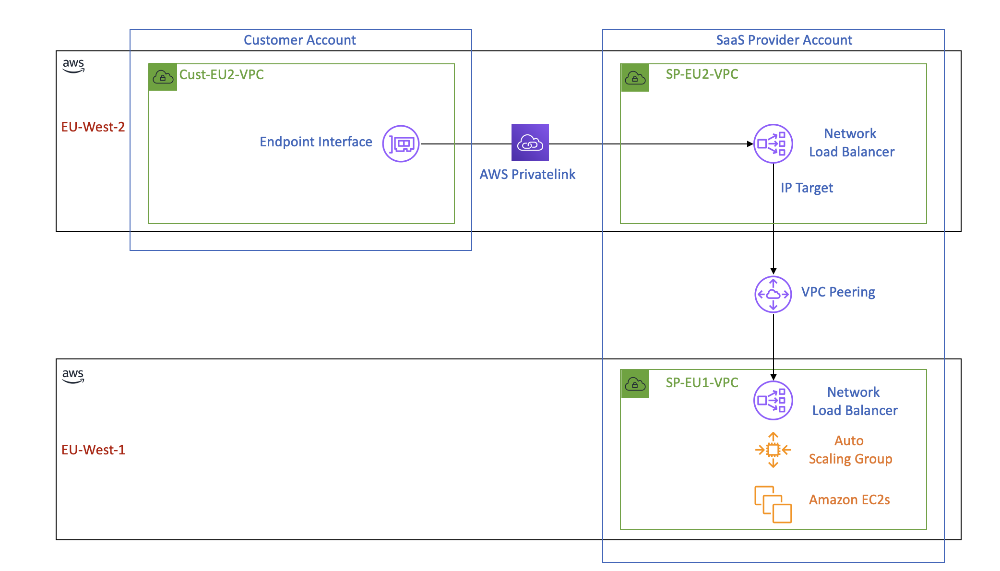

**<h1>Creating an AWS Cross-Region VPC PrivateLink using VPC Peering with Terraform (Draft, work in progress)</h1>**

**<h2>Description</h2>**
This blog post provides a step-by-step guide on setting up an AWS cross-region VPC PrivateLink using VPC peering for SaaS providers who host their platform in one AWS region while serving customers in another region. The setup ensures secure and efficient access to the SaaS platform via AWS PrivateLink, avoiding traffic traversing the public internet. The post covers creating separate AWS accounts for the provider and customer, setting up Terraform configurations and variables, deploying a static website using an autoscaling group for the provider, establishing VPC peering between the provider's regions, and setting up PrivateLink for both the provider and customer.

**<h3>Introduction</h3>**



SaaS providers often need to cater to customers across various geographical locations. To provide a secure and efficient way for customers to access their platform, SaaS providers can utilize AWS PrivateLink. By creating a cross-region VPC PrivateLink using VPC peering, SaaS providers can securely serve customers in different AWS regions, even if their platform is deployed in just one region.

This blog post will guide you through the process of creating a cross-region VPC PrivateLink for a SaaS provider who hosts their platform in the EU-WEST-1 region and serves customers in the EU-WEST-2 region. We will use Terraform to automate the creation of resources and cover the following steps:

1. Create separate AWS accounts for the SaaS provider and customer
2. Set up Terraform configurations and variables
3. Deploy the SaaS provider's infrastructure in the EU-WEST-1 region
4. Establish VPC peering between the SaaS provider's EU-WEST-1 and EU-WEST-2 regions
5. Set up PrivateLink for the SaaS provider in the EU-WEST-2 region
6. Set up PrivateLink in the customer's EU-WEST-2 VPC
7. Deploy a test instance in the customer's EU-WEST-2 VPC
8. Verify the connectivity

**<h3>Prerequisites</h3>**
* Two AWS accounts (one for the SaaS provider and one for the customer) with the necessary permissions to create resources
* Terraform installed on your local machine
* Basic understanding of AWS VPC, PrivateLink, and Terraform

**<h3>Step 1: Create separate AWS accounts for the SaaS provider and customer</h3>**
In this tutorial, we assume that you have already set up two separate AWS accounts: one for the SaaS provider and another for the customer. If you haven't done so, please follow the AWS documentation on Creating and Managing an AWS Account to create two new accounts.

After creating the AWS accounts, proceed with configuring AWS CLI and Terraform to use separate profiles for the SaaS provider and customer. Configure the AWS CLI profiles by adding the following to your ~/.aws/credentials file:

Remark: if you are using AWS Cloud9, you can assign a role with the necessary permission to work in both accounts instead of using the credential file.

```
[saas_provider]
aws_access_key_id = <SAAS_PROVIDER_AWS_ACCESS_KEY_ID>
aws_secret_access_key = <SAAS_PROVIDER_AWS_SECRET_ACCESS_KEY>

[customer]
aws_access_key_id = <CUSTOMER_AWS_ACCESS_KEY_ID>
aws_secret_access_key = <CUSTOMER_AWS_SECRET_ACCESS_KEY>
```
Next, create a providers.tf file that sets up the AWS providers for both the SaaS provider and the customer using their respective profiles:

```
provider "aws" {
  alias   = "sp_eu1"
  region  = "eu-west-1"
  profile = "saas_provider"
}

provider "aws" {
  alias   = "sp_eu2"
  region  = "eu-west-2"
  profile = "saas_provider"
}

provider "aws" {
  alias   = "cust_eu2"
  region  = "eu-west-2"
  profile = "customer"
}
```

By completing step 1, you have created separate AWS accounts for the SaaS provider and customer and configured Terraform to use their respective profiles.

**<h3>Step 2: Set up Terraform configurations and variables</h3>**

In this step, we will create a Terraform configuration file to store all the necessary variables for our setup. This file will include variables for both the SaaS provider and customer accounts. We will also include default values for the SaaS provider's EU-WEST-1 and customer's EU-WEST-2 regions.

Create a file called variables.tf and include the following variables:

```
variable "sp_eu1_ami_ssm_parameter_name" {
  description = "The SSM parameter name for the SaaS provider's EC2 AMI in the EU-WEST-1 region"
  default     = "/aws/service/ami-amazon-linux-latest/amzn2-ami-hvm-x86_64-gp2"
}

variable "sp_instance_type" {
  description = "EC2 instance type for the SaaS provider's static website"
  default     = "t2.micro"
}

variable "sp_key_pair_name" {
  description = "The name of the key pair for the SaaS provider's EC2 instances"
  default     = "sp_ec2_key_name"
}

variable "sp_eu1_vpc_cidr" {
  description = "The CIDR block for the SaaS provider's VPC in EU-WEST-1 region"
  default     = "10.0.0.0/16"
}

variable "sp_eu1_subnet_cidrs" {
  description = "The CIDR blocks for the SaaS provider's subnets in EU-WEST-1 region"
  default = {
    "subnet_a" = "10.0.1.0/24"
    "subnet_b" = "10.0.2.0/24"
    "subnet_c" = "10.0.3.0/24"
  }
}

variable "aws_profile" {
  description = "AWS CLI profile to use for the SaaS provider and customer accounts"
  default     = "default"
}
```

By completing step 2, you have created a Terraform configuration file containing all the necessary variables for our cross-region VPC PrivateLink setup. These variables include default values for the SaaS provider's EU-WEST-1 and customer's EU-WEST-2 regions, which can be modified as needed for your specific setup.

**<h3>Step 3: Deploy the SaaS provider's infrastructure in the EU-WEST-1 region</h3>**
In this step, we will deploy the SaaS provider's infrastructure in the EU-WEST-1 region, create the EC2 key pair, and store it in AWS Secrets Manager. This includes creating a VPC, an autoscaling group with EC2 instances, and a security group. We will use Terraform to automate the creation of these resources.

Create a file called sp_eu1_infra.tf and add the following code:
```
resource "tls_private_key" "sp_eu1_key" {
  algorithm = "RSA"
}

resource "aws_key_pair" "sp_eu1_key" {
  provider = aws.sp_eu1

  key_name   = var.sp_key_pair_name
  public_key = tls_private_key.sp_eu1_key.public_key_openssh
}

resource "aws_secretsmanager_secret" "sp_eu1_key_secret" {
  provider = aws.sp_eu1

  name = "${var.sp_key_pair_name}_private_key"
}

resource "aws_secretsmanager_secret_version" "sp_eu1_key_secret_version" {
  provider = aws.sp_eu1

  secret_id     = aws_secretsmanager_secret.sp_eu1_key_secret.id
  secret_string = tls_private_key.sp_eu1_key.private_key_pem
}

resource "aws_vpc" "sp_eu1_vpc" {
  provider = aws.sp_eu1

  cidr_block = var.sp_eu1_vpc_cidr

  tags = {
    Name = "sp-eu1-vpc"
  }
}

resource "aws_subnet" "sp_eu1_subnet" {
  count    = length(var.sp_eu1_subnet_cidrs)
  provider = aws.sp_eu1

  cidr_block = element(values(var.sp_eu1_subnet_cidrs), count.index)
  vpc_id     = aws_vpc.sp_eu1_vpc.id

  tags = {
    Name = "sp-eu1-subnet-${element(keys(var.sp_eu1_subnet_cidrs), count.index)}"
  }
}

resource "aws_security_group" "sp_eu1_sg" {
  provider = aws.sp_eu1

  name        = "sp-eu1-sg"
  description = "Security group for the SaaS provider static website in EU-WEST-1"
  vpc_id      = aws_vpc.sp_eu1_vpc.id
}

resource "aws_security_group_rule" "sp_eu1_sg_allow_http" {
  provider = aws.sp_eu1

  security_group_id = aws_security_group.sp_eu1_sg.id

  type        = "ingress"
  from_port   = 80
  to_port     = 80
  protocol    = "tcp"
  cidr_blocks = ["0.0.0.0/0"]
}

data "aws_ssm_parameter" "sp_eu1_ami_id" {
  name = var.sp_eu1_ami_ssm_parameter_name
}

resource "aws_launch_configuration" "sp_eu1_lc" {
  provider = aws.sp_eu1

  name_prefix = "sp-eu1-lc"
  image_id    = data.aws_ssm_parameter.sp_eu1_ami_id.value
  instance_type = var.sp_instance_type
  key_name      = var.sp_key_pair_name

  user_data = <<-EOF
                #!/bin/bash
                yum install -y httpd
                systemctl start httpd
                systemctl enable httpd
                echo "<h1>Hello World</h1><p>AWS Cross region privatelink using vpc peering, successful</p>" > /var/www/html/index.html
              EOF

  security_groups = [aws_security_group.sp_eu1_sg.id]

  lifecycle {
    create_before_destroy = true
  }
}

resource "aws_autoscaling_group" "sp_eu1_asg" {
  provider = aws.sp_eu1

  name_prefix = "sp-eu1-asg"
  max_size    = 3
  min_size    = 1
  desired_capacity = 2

  vpc_zone_identifier = aws_subnet.sp_eu1_subnet.*.id
  launch_configuration = aws_launch_configuration.sp_eu1_lc.name

  lifecycle {
    create_before_destroy = true
  }
}
```

Run terraform init to initialize the Terraform working directory, followed by terraform apply to deploy the SaaS provider's infrastructure in the EU-WEST-1 region.

By completing step 3, you have successfully deployed the SaaS provider's infrastructure, including a VPC, autoscaling group, and security group, in the EU-WEST-1 region using Terraform. You have also created the EC2 key pair and stored it in AWS Secrets Manager. The infrastructure now has three subnets in separate availability zones, the AMI is looked up using SSM parameter, and the user data script installs the static website with the specified header and content on the EC2 instances.

**<h3>Step 4: Establish VPC peering between the SaaS provider's EU-WEST-1 and EU-WEST-2 regions</h3>**
In this step, we will create VPC peering between the SaaS provider's EU-WEST-1 and EU-WEST-2 regions. This allows the SaaS provider to create an endpoint service in the EU-WEST-2 region to be accessed by customers over AWS PrivateLink.

Create a file called sp_vpc_peering.tf and add the following code:

```
resource "aws_vpc" "sp_eu2_vpc" {
  provider = aws.sp_eu2

  cidr_block = "10.1.0.0/16"

  tags = {
    Name = "sp-eu2-vpc"
  }
}

resource "aws_vpc_peering_connection" "sp_vpc_peering" {
  provider = aws.sp_eu1

  vpc_id        = aws_vpc.sp_eu1_vpc.id
  peer_vpc_id   = aws_vpc.sp_eu2_vpc.id
  peer_region   = "eu-west-2"
  peer_owner_id = "<SAAS_PROVIDER_ACCOUNT_ID>" # Replace with the actual SaaS provider's AWS account ID

  auto_accept = false

  tags = {
    Name = "sp-vpc-peering"
  }
}

resource "aws_vpc_peering_connection_accepter" "sp_vpc_peering_accepter" {
  provider = aws.sp_eu2

  vpc_peering_connection_id = aws_vpc_peering_connection.sp_vpc_peering.id
  auto_accept               = true

  tags = {
    Name = "sp-vpc-peering-accepter"
  }
}

resource "aws_route" "sp_eu1_vpc_peering_route" {
  provider = aws.sp_eu1

  route_table_id         = aws_vpc.sp_eu1_vpc.main_route_table_id
  destination_cidr_block = aws_vpc.sp_eu2_vpc.cidr_block
  vpc_peering_connection_id = aws_vpc_peering_connection.sp_vpc_peering.id
}

resource "aws_route" "sp_eu2_vpc_peering_route" {
  provider = aws.sp_eu2

  route_table_id         = aws_vpc.sp_eu2_vpc.main_route_table_id
  destination_cidr_block = aws_vpc.sp_eu1_vpc.cidr_block
  vpc_peering_connection_id = aws_vpc_peering_connection.sp_vpc_peering.id
}
```
Run terraform apply to create the VPC peering connection between the SaaS provider's EU-WEST-1 and EU-WEST-2 VPCs.

By completing step 4, you have successfully established VPC peering between the SaaS provider's EU-WEST-1 and EU-WEST-2 regions. This will allow the SaaS provider to create an endpoint service in the EU-WEST-2 region, which can be accessed by customers over AWS PrivateLink.

**<h3>Step 5: Create an endpoint service in the SaaS provider's EU-WEST-2 region</h3>**
In this step, we will create an endpoint service in the SaaS provider's EU-WEST-2 region. This endpoint service will allow customers in the EU-WEST-2 region to access the SaaS provider's static website over AWS PrivateLink.

First, create a file called sp_eu2_endpoint_service.tf and add the following code:

```
resource "aws_security_group" "sp_eu2_sg" {
  provider = aws.sp_eu2

  name        = "sp-eu2-sg"
  description = "Security group for the SaaS provider static website in EU-WEST-2"
  vpc_id      = aws_vpc.sp_eu2_vpc.id
}

resource "aws_security_group_rule" "sp_eu2_sg_allow_http" {
  provider = aws.sp_eu2

  security_group_id = aws_security_group.sp_eu2_sg.id

  type        = "ingress"
  from_port   = 80
  to_port     = 80
  protocol    = "tcp"
  cidr_blocks = ["0.0.0.0/0"]
}

resource "aws_subnet" "sp_eu2_subnet" {
  provider = aws.sp_eu2

  count = 3

  cidr_block        = "10.1.${count.index + 1}.0/24"
  vpc_id            = aws_vpc.sp_eu2_vpc.id
  availability_zone = "eu-west-2${count.index == 0 ? "a" : count.index == 1 ? "b" : "c"}"

  tags = {
    Name = "sp-eu2-subnet-${count.index + 1}"
  }
}

resource "aws_lb" "sp_eu2_lb" {
  provider = aws.sp_eu2

  name               = "sp-eu2-lb"
  internal           = true
  load_balancer_type = "network"
  subnets            = aws_subnet.sp_eu2_subnet.*.id

  tags = {
    Name = "sp-eu2-lb"
  }
}

resource "aws_lb_target_group" "sp_eu2_tg" {
  provider = aws.sp_eu2

  name     = "sp-eu2-tg"
  port     = 80
  protocol = "TCP"
  vpc_id   = aws_vpc.sp_eu2_vpc.id
}

resource "aws_lb_listener" "sp_eu2_listener" {
  provider = aws.sp_eu2

  load_balancer_arn = aws_lb.sp_eu2_lb.arn
  port              = 80
  protocol          = "TCP"

  default_action {
    type             = "forward"
    target_group_arn = aws_lb_target_group.sp_eu2_tg.arn
  }
}

resource "aws_vpc_endpoint_service" "sp_eu2_endpoint_service" {
  provider = aws.sp_eu2

  acceptance_required        = true
  network_load_balancer_arns = [aws_lb.sp_eu2_lb.arn]

  allowed_principals = ["arn:aws:iam::<CUSTOMER_ACCOUNT_ID>:root"] # Replace <CUSTOMER_ACCOUNT_ID> with the actual customer's AWS account ID

  tags = {
    Name = "sp-eu2-endpoint-service"
  }
}
```
Run terraform apply to create the endpoint service in the SaaS provider's EU-WEST-2 region.

By completing step 5, you have successfully created an endpoint service in the SaaS provider's EU-WEST-2 region, allowing customers in the EU-WEST-2 region to access the SaaS provider's static website over AWS PrivateLink.

**<h3>Step 6: Set up the customer's infrastructure in the EU-WEST-2 region</h3>**
In this step, we will configure the customer's VPC in the EU-WEST-2 region, including creating a VPC, a subnet, and a security group. The security group will allow RDP access to the Windows instances for testing the provider's static website.

Remark: When using AWS PrivateLink, it is possible to have overlapping CIDR ranges for the customer and provider VPCs. Since PrivateLink works on a higher level using service endpoints, it does not rely on IP addresses to establish connectivity, and thus IP address conflicts are not a concern in this case. However, while it is possible, we should use non-overlapping CIDR ranges if allowed.

Create a file called cust_eu2_infra.tf and add the following code:

```
resource "aws_vpc" "cust_eu2_vpc" {
  provider = aws.cust_eu2

  cidr_block = "10.1.0.0/16"

  tags = {
    Name = "cust-eu2-vpc"
  }
}

resource "aws_subnet" "cust_eu2_subnet" {
  provider = aws.cust_eu2

  cidr_block = "10.1.1.0/24"
  vpc_id     = aws_vpc.cust_eu2_vpc.id

  tags = {
    Name = "cust-eu2-subnet"
  }
}

resource "aws_security_group" "cust_eu2_sg" {
  provider = aws.cust_eu2

  name        = "cust-eu2-sg"
  description = "Security group for the customer's instances in EU-WEST-2"
  vpc_id      = aws_vpc.cust_eu2_vpc.id
}

resource "aws_security_group_rule" "cust_eu2_sg_allow_rdp" {
  provider = aws.cust_eu2

  security_group_id = aws_security_group.cust_eu2_sg.id

  type        = "ingress"
  from_port   = 3389
  to_port     = 3389
  protocol    = "tcp"
  cidr_blocks = ["0.0.0.0/0"]
}
```
Run terraform init to initialize the Terraform working directory, followed by terraform apply to deploy the customer's infrastructure in the EU-WEST-2 region.

By completing step 6, you have successfully set up the customer's infrastructure in the EU-WEST-2 region, including a VPC and security group, using Terraform.

**<h3>Step 7: Create a VPC endpoint in the customer's EU-WEST-2 region and connect to the SaaS provider's endpoint service</h3>**

In this step, we will create a VPC endpoint in the customer's EU-WEST-2 region and connect it to the SaaS provider's endpoint service, allowing the customer to access the SaaS provider's static website over AWS PrivateLink.

Create a file called cust_eu2_vpc_endpoint.tf and add the following code:

```
resource "aws_vpc_endpoint" "cust_eu2_vpc_endpoint" {
  provider = aws.cust_eu2

  vpc_id              = aws_vpc.cust_eu2_vpc.id
  vpc_endpoint_type   = "Interface"
  service_name        = aws_vpc_endpoint_service.sp_eu2_endpoint_service.service_name
  subnet_ids          = [aws_subnet.cust_eu2_subnet.id]
  security_group_ids  = [aws_security_group.cust_eu2_sg.id]
  private_dns_enabled = true

  policy = jsonencode({
    Version = "2012-10-17"
    Statement = [
      {
        Action   = "*"
        Effect   = "Allow"
        Resource = "*"
        Principal = {
          AWS = "arn:aws:iam::<SAAS_PROVIDER_ACCOUNT_ID>:root" # Replace <SAAS_PROVIDER_ACCOUNT_ID> with the actual SaaS provider's AWS account ID
        }
      }
    ]
  })

  tags = {
    Name = "cust-eu2-vpc-endpoint"
  }
}
```
Run terraform apply to create the VPC endpoint in the customer's EU-WEST-2 region and connect it to the SaaS provider's endpoint service.

By completing step 7, you have successfully created a VPC endpoint in the customer's EU-WEST-2 region and connected it to the SaaS provider's endpoint service. This allows the customer to access the SaaS provider's static website over AWS PrivateLink, even though the SaaS provider's platform is only deployed in the EU-WEST-1 region.

**<h3>Step 8: Test the connection between the customer's VPC endpoint and the SaaS provider's static website</h3>**
In this step, we will launch a Windows EC2 instance in the customer's VPC in the EU-WEST-2 region to test the PrivateLink connection to the SaaS provider's static website.

Create a new Windows EC2 instance in the customer's VPC in the EU-WEST-2 region. Make sure to select an appropriate Windows AMI and use the cust_eu2_instance_sg security group created earlier. Place the instance in one of the customer's subnets.

Once the instance is launched and running, retrieve the Administrator password from the AWS Management Console. You will need the private key associated with the key pair specified during instance creation to decrypt the password.

Connect to the Windows EC2 instance using Remote Desktop Protocol (RDP). Use the decrypted Administrator password and the instance's public IP address to establish the connection.

Once connected to the instance, open a web browser such as Internet Explorer or Microsoft Edge, and visit the SaaS provider's static website using the internal load balancer DNS name retrieved from the output of Terraform in step 7. You should see the "Hello World" header and the "AWS Cross-region privatelink using VPC peering, successful" content, indicating that the connection through the PrivateLink is working as expected.

By completing step 8, you have successfully tested the PrivateLink connection from the customer's environment in the EU-WEST-2 region to the SaaS provider's static website in the EU-WEST-1 region.


**<h3></h3>**
